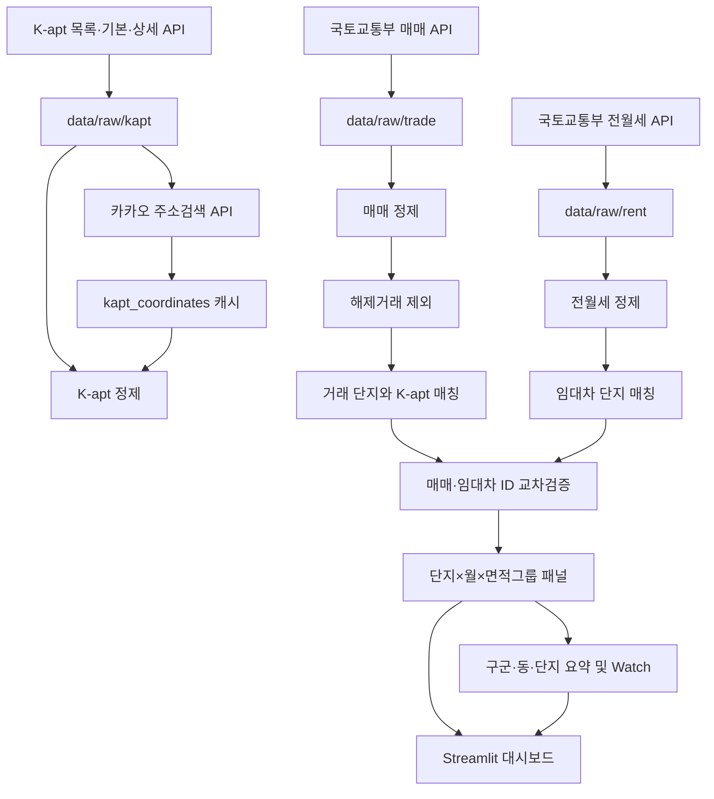

# 부산 아파트 데이터 분석 프로젝트 상세 현황 보고서

> 작성 기준일: 2026-09-12  
> 분석 기준: 현재 저장소의 코드, 설정, Git 이력, 테스트 및 저장된 데이터 산출물  
> 대상 독자: 이 프로젝트를 처음 실행하거나 유지보수하는 사용자

## 1. 보고서 목적

이 문서는 `busan_apartment_analysis` 프로젝트가 현재 어디까지 구현되었는지, 어떤 공공데이터를 어떤 절차로 수집하고 정제하는지, 분석 지표가 어떻게 계산되는지, 그리고 결과를 어떻게 확인해야 하는지를 설명한다.

프로젝트는 부산광역시 16개 구·군의 아파트 매매 및 전월세 실거래 자료와 K-apt 공동주택 단지정보를 결합해 다음 단위로 시장을 탐색하는 데이터 파이프라인과 Streamlit 대시보드를 제공한다.

```text
부산 전체
  └─ 구·군
      └─ 법정동
          └─ 아파트 단지
              └─ 전용면적 그룹
                  └─ 월별 집계 및 개별 거래
```

이 프로젝트의 결과는 투자 추천, 매수 신호 또는 재건축 가능성 판정이 아니다. 신고 자료와 공동주택 관리정보를 정리한 탐색 자료이며, 표본 수와 단지 매칭 품질을 함께 확인해야 한다.

## 2. 현재 상태 요약

현재 프로젝트는 데이터 수집부터 대시보드 조회까지 한 번에 운영할 수 있는 단계다.

| 구분 | 현재 상태 |
|---|---|
| 매매 실거래 수집 | 구현 완료, 부산 16개 구·군 × 월 단위 저장 |
| 전월세 실거래 수집 | 구현 완료, 전세·월세 구분 및 계약 상세 보존 |
| K-apt 수집 | 단지 목록, 기본정보, 상세정보 수집 구현 완료 |
| 좌표 보강 | 카카오 주소검색 API와 재시작 가능한 캐시 구현 완료 |
| 데이터 정제 | 금액·면적·날짜·층·단지명·해제거래 처리 구현 완료 |
| 단지 매칭 | 도로명·지번 주소 우선, 단지명 유사도 보조 방식 구현 완료 |
| 매매·임대차 ID 정합성 | 교차 보정 및 불일치 검증 구현 완료 |
| 월별 분석 패널 | 매매 및 전월세 패널 생성 완료 |
| 분석 결과 | 구·군/동/단지 요약, 대표단지, 회복·노후 Watch 생성 완료 |
| 대시보드 | 10개 화면과 상세 이동 기능 구현 완료 |
| 자동 테스트 | 72개 통과 |
| 학교 데이터 | Excel 파일만 추가되어 있고 현재 코드에는 연결되지 않음 |

현재 저장된 데이터는 2020년 1월부터 2026년 8월까지다. 매매와 전월세 모두 80개월 × 16개 구·군, 즉 각각 1,280개 원본 파일이 존재한다. 월별 파일 누락은 확인되지 않았다.

## 3. 현재 데이터 스냅샷

아래 수치는 2026-09-12에 현재 파일을 직접 읽어 확인한 결과다. 최종 분석 산출물의 수정 시각은 주로 2026-09-04이며, K-apt 수집 품질표는 2026-09-02 기준이다. 따라서 원본을 다시 수집하거나 `build`를 실행하면 수치는 달라질 수 있다.

### 3.1 원본과 정제 데이터

| 데이터 | 기간 | 파일 수 | 행 수 |
|---|---:|---:|---:|
| 매매 원본 | 2020-01 ~ 2026-08 | 1,280 | 248,868 |
| 전월세 원본 | 2020-01 ~ 2026-08 | 1,280 | 420,419 |
| K-apt 원본 | 수집 시점의 부산 단지 목록 | 1 | 1,468 |
| 매매 정제 전체 | 2020-01 ~ 2026-08 | 1 | 239,139 |
| 해제거래 제외 매매 분석자료 | 2020-01 ~ 2026-08 | 1 | 223,932 |
| 전월세 정제·매칭자료 | 2020-01 ~ 2026-08 | 1 | 420,419 |

매매 정제 전체 239,139건에는 해제거래 15,207건이 보존되어 있다. 분석과 단지 매칭에는 이 해제거래를 제외한 223,932건이 사용된다. 전월세 자료는 동일한 날짜·금액·면적의 계약이라도 서로 다른 세대의 정상 계약일 수 있으므로 임의로 중복 제거하지 않는다.

전월세 구성은 다음과 같다.

| 유형 | 계약 수 |
|---|---:|
| 전세 | 247,576 |
| 월세 | 172,843 |
| 합계 | 420,419 |

### 3.2 분석 산출물

| 산출물 | 행 수 | 의미 |
|---|---:|---|
| `busan_apartment_monthly.parquet` | 581,334 | 단지 × 월 × 7개 면적그룹 매매 패널 |
| `busan_apartment_rent_monthly.parquet` | 660,468 | 단지 × 월 × 면적그룹 임대차 패널 |
| `busan_complex_summary.csv` | 4,409 | 내부 단지 ID별 최신 요약 |
| `busan_district_summary.csv` | 16 | 부산 16개 구·군 요약 |
| `busan_dong_summary.csv` | 152 | 법정동별 요약 |
| `representative_complexes.csv` | 738 | 구·군 및 동별 대표단지 상위 목록 |
| `recovery_watchlist.csv` | 112 | 설정 기준을 통과한 시장회복 관찰대상 |
| `old_apartment_watchlist.csv` | 424 | 사용승인 후 30년 이상 단지 |

매매 패널의 581,334행에는 거래가 없는 달을 0건으로 채운 행도 포함된다. 실제 거래가 존재하는 단지·월·면적그룹 행은 117,107개다. 이 구조는 3·6·12개월 롤링 지표를 중간에 빠진 달 없이 계산하기 위한 것이다.

### 3.3 단지 매칭 현황

매매 단지 매칭률은 거래 건수 비율이 아니라, `구·군 코드 + 법정동 + 지번 + 정규화 단지명`으로 만든 4,499개 고유 거래 단지키를 기준으로 계산한다.

| 지표 | 현재 값 | 해석 |
|---|---:|---|
| 주소 exact 계열 | 31.01% | 도로명 또는 지번 주소가 K-apt와 정확히 연결된 단지키 |
| fuzzy 및 주소 주번 계열 | 1.13% | 같은 동의 이름 유사도 또는 주소 주번으로 연결된 단지키 |
| 전체 K-apt 매칭 | 32.14% | K-apt 코드가 부여된 거래 단지키 |
| 미매칭/주소충돌 | 67.86% | 내부 ID로 보존하거나 주소충돌로 분류한 단지키 |
| K-apt 단지 커버리지 | 92.37% | 전체 K-apt 단지 중 거래 매칭에 한 번 이상 사용된 단지 비율 |
| 수동 검토 대상 | 3,098개 | 미매칭, 주소충돌, 점수 90 미만 등 |

매칭률 32.14%가 낮아 보이지만 K-apt 커버리지는 92.37%다. 이는 실거래 자료에는 K-apt 의무관리 범위 밖의 소규모 단지와 표기 변형 단지가 많이 존재하고, K-apt에 등록된 주요 단지는 대부분 연결되었다는 두 현상이 동시에 나타난 결과다. 미매칭 거래를 삭제하지 않고 `TRADE_`로 시작하는 안정적인 내부 ID를 만들어 분석에 보존한다.

전월세는 4,476개 거래 단지키 중 1,532개가 K-apt에 연결되어 매칭률이 34.23%이며, 수동 검토 대상은 2,993개다. 매매 자료와 공유하는 단지키 또는 도로명 주소가 명확하면 매매의 내부 ID를 전월세에 재사용한다. 현재 교차 보정은 4건이며, 보정 후 남은 매매·전월세 단지 ID 충돌은 0건이다.

## 4. 프로젝트가 발전해 온 과정

Git 이력에서 확인되는 주요 진행 과정은 다음과 같다.

| 날짜 | 변경 내용 |
|---|---|
| 2026-09-03 | 최초 Streamlit 앱, 매매/K-apt 파이프라인, 정제·매칭·분석·시각화·테스트 구성 |
| 2026-09-03 | 대용량 패널 로딩과 대시보드 메모리 사용 최적화 |
| 2026-09-04 | 결과 목록과 그래프에서 아파트 상세 화면으로 이동하는 상호작용 보완 |
| 2026-09-04 | 전월세 수집·정제·매칭, 전세가율과 계약 상세 화면 추가 |
| 2026-09-05 | README 정리 |
| 2026-09-11 | `phase149_school_value_master.xlsx` 추가 |

마지막 Excel 파일은 파일명상 학교 가치 관련 후속 자료로 보이지만, 현재 Python 코드·설정·README 어느 곳에서도 참조하지 않는다. 따라서 현 단계에서는 파이프라인에 연결된 기능이 아니라 향후 확장을 위한 별도 자료로 보는 것이 안전하다.

## 5. 전체 데이터 흐름



데이터 디렉터리는 처리 단계별로 나뉜다.

| 경로 | 역할 | 원칙 |
|---|---|---|
| `data/raw` | API 응답을 월·지역별로 저장 | 원본 캐시, 직접 수정하지 않음 |
| `data/interim` | 정제 및 매칭을 끝낸 중간자료 | 재빌드와 상세 조회에 사용 |
| `data/processed` | 대시보드와 보고서용 최종자료 | 사용자가 주로 조회하는 결과 |
| `reports` | 품질 및 매칭 진단표 | 오류가 아닌 검토 대상도 포함 |

## 6. 처음 사용자를 위한 준비

### 6.1 필요한 환경

- Python 3.11 이상
- 인터넷 연결
- 공공데이터포털 활용신청 및 인증키
- 좌표가 필요하면 카카오 디벨로퍼스 REST API 키

현재 점검에 사용된 환경은 Python 3.13 계열, pandas 2.2.3, pyarrow 24.0.0, Streamlit 1.59.2다. 패키지 허용 범위는 `requirements.txt`에 정의되어 있다.

### 6.2 가상환경 설치

PowerShell에서 프로젝트 폴더로 이동한 다음 실행한다.

```powershell
python -m venv .venv
.\.venv\Scripts\Activate.ps1
python -m pip install -r requirements.txt
```

활성화 정책 오류가 나면 현재 PowerShell 세션에서만 다음 명령을 먼저 실행할 수 있다.

```powershell
Set-ExecutionPolicy -Scope Process -ExecutionPolicy Bypass
.\.venv\Scripts\Activate.ps1
```

macOS/Linux에서는 활성화 명령을 다음과 같이 바꾼다.

```bash
source .venv/bin/activate
```

### 6.3 API 활용신청

공공데이터포털에서 다음 서비스의 활용신청이 필요하다.

1. 국토교통부 아파트 매매 실거래가 상세 자료
2. 국토교통부 아파트 전월세 실거래가 자료
3. 공동주택 단지 목록
4. 공동주택 기본정보

같은 공공데이터포털 인증키라도 서비스별 활용승인이 필요할 수 있다. `KAPT_API_KEY`가 없으면 코드는 `PUBLIC_DATA_API_KEY`를 K-apt에도 대체 사용하지만, 해당 키에 K-apt 서비스 권한이 있어야 한다.

좌표 보강에는 카카오 디벨로퍼스 애플리케이션에서 발급한 REST API 키가 필요하다.

### 6.4 `.env` 작성

`.env.example`을 `.env`로 복사하고 값을 입력한다.

```powershell
Copy-Item .env.example .env
```

```dotenv
PUBLIC_DATA_API_KEY=공공데이터포털_인증키
KAPT_API_KEY=K-apt에_사용할_인증키
KAKAO_API_KEY=카카오_REST_API_키
```

`.env`는 `.gitignore`에 포함되어 있다. 키를 README, 소스코드, 화면 캡처 또는 실행 로그에 붙여 넣지 않는다.

## 7. 데이터 수집 방법과 내부 절차

### 7.1 부산 지역 코드

`config/busan_region_codes.csv`에는 부산의 16개 구·군과 5자리 법정 시군구 코드가 들어 있다.

```text
중구 26110, 서구 26140, 동구 26170, 영도구 26200
부산진구 26230, 동래구 26260, 남구 26290, 북구 26320
해운대구 26350, 사하구 26380, 금정구 26410, 강서구 26440
연제구 26470, 수영구 26500, 사상구 26530, 기장군 26710
```

수집 명령에서 `--lawd-cd`를 생략하면 이 16개 지역을 모두 순회한다.

### 7.2 매매 실거래 수집

전체 기간 수집 예시는 다음과 같다.

```powershell
python main.py collect-trade --start 202001 --end 202608
```

해운대구만 다시 수집하려면 다음과 같이 실행한다.

```powershell
python main.py collect-trade --start 202607 --end 202608 --lawd-cd 26350 --force
```

내부 절차는 다음과 같다.

1. 시작월부터 종료월까지 `YYYYMM` 목록을 만든다.
2. 각 월마다 부산 16개 구·군 코드를 순회한다.
3. API에 `LAWD_CD`, `DEAL_YMD`, 페이지 번호와 페이지당 1,000건을 전달한다.
4. 응답의 `totalCount`를 보고 마지막 페이지까지 반복한다.
5. HTTP 실패 시 최대 4회, 1.5 배수의 지수 백오프로 재시도한다.
6. 결과를 `data/raw/trade/YYYYMM/{lawd_cd}.parquet`에 저장한다.
7. 한 지역/월이 실패해도 나머지 수집은 계속하고 `failed` 통계와 로그를 남긴다.

이미 파일이 있으면 기본적으로 건너뛴다. 신고 내용 갱신 가능성이 있는 최근 월을 다시 받을 때만 `--force`를 사용한다. `--force`는 지정한 범위의 기존 파일을 새 API 응답으로 교체하므로 기간과 구·군을 좁혀 사용하는 편이 관리하기 쉽다.

### 7.3 전월세 실거래 수집

```powershell
python main.py collect-rent --start 202001 --end 202608
```

매매 수집과 같은 월·지역·페이지네이션·재시도 구조를 사용하며 저장 경로만 다음과 같이 다르다.

```text
data/raw/rent/YYYYMM/{lawd_cd}.parquet
```

전월세 API 활용신청이 되어 있지 않으면 매매 API와 같은 키를 사용하더라도 인증 또는 서비스 오류가 날 수 있다.

### 7.4 K-apt 단지정보 수집

```powershell
python main.py collect-kapt
```

수집 순서는 다음과 같다.

1. `AptListService4/getSidoAptList4`에 부산 시도코드 `26`을 보내 전체 단지 목록을 받는다.
2. 각 단지의 `kaptCode`로 `AptBasisInfoServiceV5/getAphusBassInfoV5` 기본정보를 받는다.
3. 같은 단지코드로 `getAphusDtlInfoV5` 상세정보를 받는다.
4. 목록·기본·상세 응답을 한 행으로 합친다.
5. 100개 단위로 진행률을 기록한다.
6. 유효성 검사를 통과한 결과만 `data/raw/kapt/busan_complexes.parquet`에 저장한다.
7. 분석용 Excel도 `data/processed/busan_kapt_apartment_analysis.xlsx`로 만든다.

수집 결과는 최소 100개 단지, 필수 단지명·주소·단지코드·세대수 필드, 단지코드 유일성을 검사한다. 검증에 실패하면 기존 정상 캐시를 덮어쓰지 않는다. 현재 K-apt 원본은 1,468개 단지이며 단지코드 중복 0, 단지명 누락 0, 도로명주소 누락 11, 주차정보 누락 51이다.

기존 캐시가 정상이라면 `collect-kapt`는 재사용한다. 새 데이터를 강제로 수집할 때만 다음 명령을 쓴다.

```powershell
python main.py collect-kapt --force
```

### 7.5 주소를 위·경도로 변환

```powershell
python main.py geocode-kapt
```

이 명령은 좌표가 없는 K-apt 단지의 도로명 또는 법정동 주소를 카카오 주소검색 API로 조회한다. 결과는 `data/interim/kapt_coordinates.parquet`에 저장된다. 50건마다 중간 저장하므로 작업이 중단되어도 성공한 단지는 다시 요청하지 않는다.

검색 실패 주소를 다시 시도하려면 다음 명령을 사용한다.

```powershell
python main.py geocode-kapt --retry-failed
```

주소 자체가 오래되었거나 검색되지 않으면 `config/geocode_address_overrides.csv`에 `kapt_code,address` 형식으로 보정 주소를 등록한 뒤 다시 실행한다. 현재 좌표 캐시는 K-apt 1,468개 행을 보유한다.

### 7.6 수집 결과 확인

각 수집 명령은 마지막에 JSON 통계를 출력한다.

```json
{
  "downloaded": 0,
  "skipped": 1280,
  "failed": 0,
  "empty": 0
}
```

- `downloaded`: 새로 저장한 지역·월 파일 수
- `skipped`: 기존 파일이 있어 건너뛴 수
- `failed`: 재시도 후에도 실패한 수
- `empty`: API가 정상 응답했지만 거래가 0건인 수

`empty`는 반드시 오류가 아니다. 거래가 없었던 지역·월일 수 있다. `failed`가 1 이상이면 로그의 지역코드와 월을 찾아 해당 범위만 다시 수집한다.

## 8. 정제 방법

### 8.1 매매 자료 정제

`src/clean_trade.py`는 API 버전별 한글·영문 필드명을 표준 열로 변환한 뒤 다음 작업을 수행한다.

1. 거래금액의 쉼표와 문자를 제거하고 원 단위로 바꾼다. API 금액 단위가 만원이므로 `금액 × 10,000`을 적용한다.
2. 전용면적, 층, 건축연도와 도로명 건물번호를 숫자로 변환한다.
3. 년·월·일을 결합해 `deal_date`를 만든다.
4. 법정동의 공백을 제거한다.
5. 단지명을 소문자화하고 괄호, `아파트`, 공백과 특수문자를 제거해 매칭용 이름을 만든다.
6. 해제사유발생일 또는 해제표시가 있으면 `is_cancelled=True`로 기록한다.
7. ㎡당 가격과 3.3㎡당 가격을 계산한다.
8. 거래 시점의 아파트 연식을 계산한다.
9. 전용면적을 7개 그룹으로 분류한다.
10. 정해진 거래 식별 열이 같은 행은 마지막 행만 남긴다.
11. 최신 잠정 기간 여부를 표시한다.

가격 산식은 다음과 같다.

```text
거래금액(원) = API 거래금액(만원) × 10,000
㎡당 가격 = 거래금액(원) ÷ 전용면적(㎡)
3.3㎡당 가격 = ㎡당 가격 × 3.3
```

면적그룹 경계는 왼쪽을 포함하고 오른쪽을 제외한다.

| 코드 | 화면 라벨 | 범위 |
|---|---|---|
| `under_40` | 소형 | 40㎡ 미만 |
| `40_55` | 49형 | 40㎡ 이상 55㎡ 미만 |
| `55_65` | 59형 | 55㎡ 이상 65㎡ 미만 |
| `65_80` | 74형 | 65㎡ 이상 80㎡ 미만 |
| `80_90` | 84형 | 80㎡ 이상 90㎡ 미만 |
| `90_120` | 중대형 | 90㎡ 이상 120㎡ 미만 |
| `over_120` | 대형 | 120㎡ 이상 |

따라서 프로젝트의 “84㎡ 가격”은 `80_90` 그룹의 실제 거래만 사용한다. 다른 평형 가격을 84㎡로 환산하지 않는다.

### 8.2 전월세 자료 정제

전월세도 금액·면적·날짜·주소·단지명을 같은 방식으로 표준화한다.

```text
보증금(원) = API 보증금(만원) × 10,000
월세(원) = API 월세금액(만원) × 10,000
```

월세금액이 0이면 전세, 0보다 크면 월세, 그 밖의 값은 미상으로 분류한다. 계약기간, 신규·갱신 구분, 갱신요구권 사용, 종전 보증금과 종전 월세도 가능한 경우 보존한다.

### 8.3 K-apt 정제

K-apt 정제에서는 다음 정보를 표준화한다.

- 단지코드, 단지명, 도로명주소, 법정동주소, 법정동, 지번
- 세대수, 동수, 사용승인일
- 지상·지하·전체 주차대수
- 난방방식, 주상복합 구분
- 위도와 경도

전체 주차대수가 없으면 지상주차와 지하주차의 합을 사용한다.

```text
아파트 연식 = 오늘 - 사용승인일의 만 경과연수
세대당 주차 = 전체 주차대수 ÷ 세대수
동당 세대수 = 세대수 ÷ 동수
```

세대수나 동수가 0이면 비율을 0으로 만들지 않고 결측값으로 둔다. 연식 그룹은 0~5년, 6~10년, 11~20년, 21~30년, 30년 초과로 나눈다.

## 9. 거래 단지와 K-apt 매칭 방법

단지 매칭은 이름만 비슷하다고 연결하지 않고 주소를 우선한다. 현재 우선순위는 다음과 같다.

1. 도로명주소와 법정동·지번 주소가 모두 같은 후보
2. 도로명주소가 같은 후보
3. 법정동·지번 주소가 같은 후보
4. 도로명 건물번호의 주번호가 같은 후보
5. 지번의 주번이 같은 후보
6. 같은 구·군과 법정동 안에서 단지명 fuzzy 유사도가 75점 이상인 후보
7. 어느 조건도 통과하지 못하면 미매칭

주소가 같은 후보가 여러 개면 정규화 단지명 유사도를 이용한다. 도로명과 지번이 각각 하나의 다른 단지를 가리키면 자동 선택하지 않고 `address_conflict`로 기록한다.

매칭 점수 90 미만, 미매칭, 주소충돌, 또는 단일 주소 후보지만 이름 유사도가 지나치게 낮은 건은 `manual_review=True`가 된다. 검토 파일은 다음 두 개다.

```text
data/processed/apartment_match_manual_review.csv
data/processed/apartment_rent_match_manual_review.csv
```

K-apt 미등록 단지는 다음 재현 가능한 내부 ID를 갖는다.

```text
TRADE_ + SHA1(지역코드|법정동|지번|정규화단지명)의 앞 12자리
```

같은 입력이면 다시 빌드해도 같은 ID가 만들어진다. 이를 통해 미매칭 단지도 시계열 분석에서 사라지지 않는다.

전월세 매칭 후에는 매매와 전월세의 동일 단지키가 서로 다른 ID를 가리키는지 검사한다. 한쪽의 연결이 유일할 때만 매매 ID로 보정하고, 여전히 충돌이 남으면 빌드를 실패시켜 잘못된 전세가율이 만들어지는 것을 막는다.

## 10. 월별 패널과 분석 산식

### 10.1 매매 월 패널

기본 집계 단위는 다음 세 열이다.

```text
internal_complex_id + year_month + area_group
```

각 그룹에서 거래량, 거래금액 중앙값·평균값, ㎡당 및 3.3㎡당 가격 중앙값을 계산한다. 거래가 없는 달도 월 패널에 추가하고 거래량을 0으로 채우되 가격은 결측으로 남긴다.

### 10.2 롤링 지표

각 단지·면적그룹별로 다음 지표를 만든다.

| 지표 | 계산 방식 |
|---|---|
| `transactions_3m/6m/12m` | 최근 3·6·12개월 거래량 합계 |
| `price_3m/6m/12m` | 월별 거래금액 중앙값의 최근 3·6·12개월 중앙값 |
| `return_3m/6m/12m` | 해당 롤링 가격을 3·6·12개월 전 값과 비교한 변화율 |
| `turnover_12m` | 최근 12개월 거래량 ÷ 세대수 |
| `district_relative_turnover` | 단지 회전율 ÷ 같은 구·군 회전율 중앙값 |
| `rolling_peak` | 과거부터 현재까지 월 가격의 최고값 |
| `drawdown_from_peak` | 현재 가격 ÷ 과거 최고값 - 1 |
| `rolling_trough` | 과거부터 현재까지 월 가격의 최저값 |
| `recovery_from_trough` | 현재 가격 ÷ 과거 최저값 - 1 |
| `sample_count` | 최근 6개월 거래량 |
| `low_sample_flag` | 최근 6개월 거래량이 3건 미만 |

여기서 `price_3m` 등은 해당 기간의 모든 개별 거래를 한 번에 계산한 중앙값이 아니라, 먼저 계산된 월별 중앙가격을 다시 롤링 중앙값으로 계산한 값이다. 거래가 많은 달에 자동으로 더 큰 가중치를 주지 않는 구조다.

세대수가 없거나 0이면 거래회전율은 결측값이다. 0으로 표시하면 거래가 전혀 없다는 뜻으로 오해할 수 있으므로 의도적으로 결측 처리한다.

### 10.3 전세가율

전월세 패널도 단지 × 월 × 면적그룹으로 집계한다.

```text
12개월 전세가율
= 최근 12개월 월별 전세보증금 중앙값의 중앙값
  ÷ 최근 12개월 월별 매매가격 중앙값의 중앙값
```

월세 계약은 보증금과 월세 중앙값 및 계약량으로 별도 표시하며 전세가율 계산에 포함하지 않는다. 전세가율도 같은 단지와 같은 면적그룹 안에서만 계산한다.

### 10.4 단지·지역 요약

단지 요약은 각 단지·면적그룹의 최신 패널 행을 기반으로 한다. 84형 지표는 `80_90` 면적그룹에서 가져오며, 전체 거래량은 단지의 면적그룹을 합산한다.

구·군과 법정동 요약에서는 단지 수, 세대수, 평균·중앙 연식, 10년 이하/20년 초과/30년 초과 비율, 500세대 이상 단지 수, 세대당 주차, 12개월 거래량과 회전율, 84형 가격과 가격변화 등을 계산한다.

### 10.5 대표단지 점수

대표단지는 구·군별 및 법정동별로 각 지표의 백분위 순위를 구한 뒤 가중합한다.

```text
대표단지 점수
= 세대수 백분위 × 0.30
 + 거래회전율 백분위 × 0.30
 + 84형 가격 백분위 × 0.25
 + 거래 면적그룹 다양성 백분위 × 0.15
```

각 구·군과 법정동에서 상위 5개를 저장한다. 이 점수는 생활환경이나 미래 수익률을 반영한 종합 투자점수가 아니라, 현재 프로젝트 안의 규모·거래·가격·면적 다양성을 합친 대표성 지표다.

### 10.6 시장회복 Watch

시장회복 관찰대상은 다음 조건을 모두 만족해야 한다.

- 최근 6개월 거래량이 직전 6개월보다 많음
- 3개월 가격변화가 0 이상이거나, 6개월 가격변화보다 2%p 이내로 개선됨
- 고점 대비 하락폭의 절댓값이 10% 이상 60% 이하
- 최근 6개월 거래량이 3건 이상
- 저표본 플래그가 아님

가격과 표본 조건은 80~90㎡ 그룹을 기준으로 하고, 단지 거래량은 모든 면적그룹을 합산한다. 결과는 회복 확정이나 매수 신호가 아니라 추가 확인 대상을 줄이는 필터다.

### 10.7 노후단지 Watch

사용승인 후 30년 이상 지난 단지를 모으고, 해당 단지의 84형 가격이 같은 구·군·법정동의 30년 이상 단지 평균과 비교해 어느 정도 할인 또는 할증되어 있는지 계산한다.

```text
동 평균 대비 가격 차이 = 단지 84형 가격 ÷ 같은 동 노후단지 평균 - 1
```

정비구역 지정, 용적률, 대지지분, 안전진단, 사업성은 포함하지 않으므로 재건축 가능성을 판단하는 자료로 사용하면 안 된다.

## 11. 빌드 실행 방법

### 11.1 전체 빌드

원본 수집 후 다음 명령을 실행한다.

```powershell
python main.py build
```

전체 빌드는 다음 순서로 진행된다.

1. 모든 매매 원본 읽기
2. 중복 정리 및 해제거래 표시
3. 해제거래를 제외한 분석 거래 생성
4. K-apt 정제 및 좌표 캐시 결합
5. 매매 단지 매칭
6. 중간자료와 매칭 진단표 저장
7. 매매 월 패널 및 롤링 지표 생성
8. 전월세 원본이 있으면 정제·매칭·교차검증
9. 전월세 월 패널과 전세가율 생성
10. 구·군·동·단지 요약과 Watch 생성
11. 데이터 품질 보고서 생성

### 11.2 증분 빌드

최근 월만 추가 또는 재수집했다면 다음 명령을 사용한다.

```powershell
python main.py build --incremental
```

기존 정제·매칭 결과 중 잠정 구간 이전 자료를 재사용하고 최근 구간만 다시 정제·매칭한다. 다만 다음 경우에는 정확성을 위해 자동으로 전체 빌드로 전환한다.

- 기존 정제·매칭 산출물이 없음
- 기존 정제자료의 마지막 월을 판단할 수 없음
- K-apt 원본이 기존 매칭 결과보다 새로움
- 잠정 구간보다 과거인 실거래 원본이 기존 빌드 후 변경됨

롤링 지표는 과거 전체 이력에 의존하므로 증분 빌드에서도 월 패널과 요약표를 다시 계산한다.

### 11.3 보고서 표만 재생성

월 패널은 그대로 두고 요약 CSV만 다시 만들려면 다음 명령을 사용한다.

```powershell
python main.py report
```

이 명령은 실거래 정제나 단지 매칭을 다시 하지 않는다. 설정의 대표단지 가중치 또는 Watch 조건만 바꾼 경우에 유용하다.

### 11.4 API 키 없는 데모

빈 작업 복사본에서만 다음 명령을 실행한다.

```powershell
python main.py demo
streamlit run app.py
```

데모는 6개 가상 단지와 2023-01~2026-06 표본 거래를 생성한 뒤 실제 파이프라인을 실행한다. 현재 프로젝트처럼 `data/raw`에 실데이터가 하나라도 있으면 데이터 보호를 위해 실행을 거부한다.

## 12. 대시보드 사용법

### 12.1 실행

```powershell
streamlit run app.py
```

브라우저가 자동으로 열리지 않으면 터미널에 표시된 주소, 보통 `http://localhost:8501`에 접속한다. 대시보드는 최종 패널과 요약 파일이 필요하므로 파일이 없다는 안내가 나오면 먼저 `python main.py build`를 실행한다.

### 12.2 현재 화면 구성

| 메뉴 | 용도 |
|---|---|
| 부산 Overview | 필터 조건에 맞는 단지를 지도와 전체 지표로 탐색 |
| 거래량 TOP 20 | 단지별 및 지역별 최근 거래량 순위 확인 |
| 아파트 TOP 20 | 실거래 평당가, 세대수, 사용승인 연식 순위 확인 |
| 실거래가 단지 검색 | 최근 거래가격·세대수·주차·연식 조건으로 단지 검색 |
| 구군 비교 | 선택 지표로 부산 16개 구·군 비교 |
| 동 비교 | 법정동별 지표 비교 |
| 아파트 상세 | 단지 가격 추이, 거래, 전월세와 전세가율 확인 |
| 아파트 비교 | 최대 5개 단지의 선택 지표 비교 |
| 시장회복 Watch | 회복 관찰 조건을 통과한 단지 검토 |
| 노후단지 Watch | 30년 이상 단지와 가격지표 검토 |

지도 마커, 일부 막대그래프 또는 표의 아파트 단지를 선택하면 상세 화면으로 이동한다. 표는 열 제목으로 정렬할 수 있으며 지정된 결과표에서는 단지명을 더블클릭해 상세 화면으로 이동한다.

### 12.3 초보자 권장 탐색 순서

1. 부산 Overview에서 기간과 구·군을 넓게 선택해 전체 분포를 본다.
2. 구군 비교에서 거래량, 회전율, 84형 가격을 비교한다.
3. 동 비교로 관심 구·군 안의 법정동 차이를 본다.
4. 거래량 TOP 20과 실거래가 단지 검색으로 후보를 좁힌다.
5. 아파트 상세에서 면적그룹을 맞추고 월별 가격, 거래량, 전세가율을 확인한다.
6. 저표본·잠정월 표시와 최근 개별 계약을 함께 확인한다.
7. 여러 단지는 아파트 비교에서 동일 지표로 비교한다.

## 13. 품질검사 결과와 올바른 해석

현재 `reports/data_quality_report.csv` 결과는 다음과 같다.

| 검사 | 건수 | 상태 | 해석 |
|---|---:|---|---|
| 0 이하 거래금액 | 0 | PASS | 비정상 금액 없음 |
| 0 이하 전용면적 | 0 | PASS | 비정상 면적 없음 |
| 미래 건축연도 | 0 | PASS | 현재연도 이후 건축연도 없음 |
| 허용범위 밖 층 | 0 | PASS | 설정 범위 -5~100층 밖 값 없음 |
| 정제 과정에서 제거된 중복키 행 | 9,729 | REVIEW | 원본 248,868건과 정제 239,139건의 차이 |
| 해제거래 | 15,207 | REVIEW | 원본·정제전체에는 보존, 분석에서는 제외 |
| 미매칭 단지키 | 3,052 | REVIEW | K-apt 미등록 또는 주소·명칭 불일치 가능 |
| 세대수 누락 K-apt 단지 | 0 | PASS | 현재 정제 K-apt 기준 |
| 주차정보 누락 K-apt 단지 | 51 | REVIEW | 세대당 주차 계산 불가 |
| IQR 기준 가격 이상치 | 1,439 | REVIEW | 자동 오류 판정이 아니라 원본 확인 대상 |

`REVIEW`는 삭제하라는 뜻이 아니다. 특히 다음처럼 해석해야 한다.

- 중복 9,729건은 전체 원본 행의 완전 중복만 센 값이 아니다. 지역·동·지번·정규화 단지명·면적·층·날짜·금액으로 정의한 중복키를 정제한 전후 행 수 차이다.
- 해제거래는 데이터 오류가 아니라 거래가 사후 해제되었다는 공식 상태다.
- 가격 이상치는 부산 전체 ㎡당 가격의 IQR 규칙으로 찾으므로 고가 단지나 특수 거래가 정상적으로 포함될 수 있다.
- 미매칭은 곧 잘못된 거래가 아니다. K-apt가 의무관리대상 중심이라 소규모 단지가 빠질 수 있다.

현재 단지 요약 4,409개 중 최신 84형 표본이 부족하거나 없는 `low_sample_flag` 대상은 3,837개다. 단지 단위의 단기 가격변화를 볼 때 표본 부족이 가장 큰 해석 제약이다.

## 14. 주요 파일 안내

### 실행과 설정

| 파일 | 역할 |
|---|---|
| `main.py` | 수집·빌드·보고서·데모 CLI 진입점 |
| `app.py` | Streamlit 대시보드 진입점 |
| `config/settings.yaml` | API, 재시도, 매칭, 점수, Watch, 품질 기준 |
| `config/busan_region_codes.csv` | 부산 16개 구·군 코드 |
| `config/geocode_address_overrides.csv` | 지오코딩 실패 주소 수동 보정 |
| `requirements.txt` | Python 패키지 버전 범위 |

### 핵심 코드

| 파일 | 역할 |
|---|---|
| `src/collect_trade.py` | 매매 월·지역별 API 수집 |
| `src/collect_rent.py` | 전월세 월·지역별 API 수집 |
| `src/collect_kapt.py` | K-apt 목록·기본·상세 수집과 검증 |
| `src/geocode_kakao.py` | 주소 좌표 변환과 캐시 |
| `src/clean_trade.py` | 매매 필드 표준화와 정제 |
| `src/clean_rent.py` | 전월세 필드 표준화와 분류 |
| `src/clean_kapt.py` | K-apt 필드 표준화와 파생변수 |
| `src/match_complex.py` | 주소 우선 exact/fuzzy 단지 매칭 |
| `src/rent_analysis.py` | 매매·임대차 ID 교차검증과 전세가율 |
| `src/aggregate.py` | 월 패널 기본 집계 |
| `src/feature_engineering.py` | 롤링 가격·거래량·회전율 계산 |
| `src/analysis.py` | 지역·단지 요약, 대표단지, Watch, 품질검사 |
| `src/pipeline.py` | 전체 및 증분 빌드 조정 |

### 운영 시 우선 확인할 결과

| 파일 | 확인 목적 |
|---|---|
| `reports/data_quality_report.csv` | 정제 및 품질 이상 유무 |
| `reports/tables/matching_rates.csv` | 매매 단지 매칭률 |
| `reports/tables/matching_method_summary.csv` | 매칭 방법별 단지 수 |
| `reports/tables/kapt_collection_quality.csv` | K-apt 수집 완전성 |
| `data/processed/apartment_match_manual_review.csv` | 매매 수동 검토 목록 |
| `data/processed/apartment_rent_match_manual_review.csv` | 임대차 수동 검토 목록 |
| `data/processed/apartment_rent_cross_market_issues.csv` | 매매·임대차 ID 충돌 여부 |

## 15. 정기 운영 절차

매월 갱신할 때는 최근 신고가 계속 수정될 수 있으므로 최근 2~3개월을 다시 받는 방식이 적절하다. 예를 들어 2026년 9월 갱신 작업은 다음 순서로 할 수 있다.

```powershell
python main.py collect-trade --start 202607 --end 202609 --force
python main.py collect-rent --start 202607 --end 202609 --force
python main.py build --incremental
python -m pytest -q
streamlit run app.py
```

K-apt를 갱신하는 달에는 다음을 앞에 추가한다.

```powershell
python main.py collect-kapt --force
python main.py geocode-kapt
```

K-apt 원본이 바뀌면 증분 빌드가 자동으로 전체 빌드로 전환된다. 단지 속성이나 주소가 바뀌었을 때 과거 거래도 다시 매칭해야 하기 때문이다.

운영 후에는 최소한 다음을 확인한다.

1. 수집 JSON의 `failed`가 0인지 확인한다.
2. 16개 구·군 파일이 월마다 존재하는지 확인한다.
3. 매매·전월세 마지막 `year_month`가 의도한 월인지 확인한다.
4. K-apt 수집 품질과 매칭률이 이전보다 급격히 나빠지지 않았는지 확인한다.
5. 매매·전월세 교차시장 이슈 파일이 0행인지 확인한다.
6. 테스트를 통과한 뒤 대시보드 핵심 화면을 직접 확인한다.

## 16. 테스트 상태

2026-09-12 현재 다음 명령으로 전체 테스트를 실행했으며 72개가 모두 통과했다.

```powershell
python -m pytest -q
```

테스트 범위에는 다음이 포함된다.

- 거래금액과 전월세 금액 변환
- 면적그룹 경계
- 해제거래 처리
- K-apt 정제와 세대수 필드 우선순위
- 주소 정규화, exact/fuzzy 매칭, 주소충돌 처리
- 매매·전월세 단지 ID 교차검증
- ㎡당·3.3㎡당 가격과 거래회전율
- 롤링 거래량 및 가격 지표
- 최근 실거래 검색과 순위
- 대시보드 상태 및 사이드바 이동
- 차트와 표에서 단지 상세 이동

테스트 통과는 현재 코드의 규칙대로 동작한다는 뜻이다. 실제 API가 필드명이나 응답 형식을 바꾸는 경우는 별도의 실응답 점검이 필요하다.

## 17. 한계와 위험요인

### 17.1 최신월 잠정성

설정상 최신 2개월을 잠정기간으로 표시한다. 기준일이 2026-09-12이므로 2026-08과 2026-09가 잠정 구간이며, 현재 데이터의 마지막 월은 2026-08이다. 저장된 정제자료에는 매매 1,552건, 전월세 3,015건이 잠정 거래로 표시되어 있다. 신고가 추가·정정·해제되면 값이 바뀐다.

### 17.2 단지 매칭

수동 검토 대상이 많고 전체 거래 단지키 기준 매칭률이 약 32%다. K-apt 속성이 없는 미매칭 단지는 세대수, 주차, 정확한 사용승인일과 좌표를 이용한 분석이 제한된다. 다음 기능으로 수동 보정 테이블을 도입할 필요가 있다.

### 17.3 표본 부족

단지·면적그룹으로 나누면 거래가 매우 적다. 특히 3개월 가격변화와 회복 Watch는 몇 건의 거래에도 크게 흔들릴 수 있다. `low_sample_flag`, 거래량과 개별 거래를 함께 확인해야 한다.

### 17.4 중앙값의 의미

롤링 가격은 월별 중앙값의 중앙값이다. 장점은 특정 거래량 많은 달이 전체 값을 지배하지 않는다는 것이고, 단점은 기간 전체 개별 거래 중앙값과 다를 수 있다는 점이다. 외부 자료와 비교할 때 집계 방식을 맞춰야 한다.

### 17.5 외부 API 변경

공공데이터 API의 엔드포인트, 서비스키 파라미터 대소문자, 응답 필드명이 변경될 수 있다. K-apt 기본 API는 `serviceKey`, 상세 API는 현재 설정상 `ServiceKey`를 사용한다. 오류가 전 지역에서 동시에 발생하면 키보다 먼저 API 명세와 `config/settings.yaml`을 점검한다.

### 17.6 아직 연결되지 않은 외부 요인

지하철, 학교·학군, 상권, 해안·공원, 고도, 입주물량, 인구, 한국부동산원 지수와 가격예측 모델은 현재 파이프라인에 없다. 저장소의 학교 관련 Excel 역시 아직 분석과 대시보드에 연결되지 않았다.

## 18. 개선 우선순위 제안

현재 상태에서 효과가 큰 순서는 다음과 같다.

1. **수동 매칭 보정 테이블 도입**: 거래 단지키와 확정 K-apt 코드 또는 내부 ID를 CSV로 관리하고 빌드 때 자동 적용한다.
2. **매칭 품질 분리 평가**: 단지키 비율뿐 아니라 거래 건수 가중 매칭률, 세대수 가중 커버리지, 구·군별 매칭률을 함께 제공한다.
3. **API 실응답 회귀 테스트**: 각 API 응답 샘플을 비밀정보 없이 보관하고 필드 별칭과 단위 변경을 자동 검출한다.
4. **품질 보고서 명확화**: 중복키 제거, 해제거래, 통계 이상치를 오류와 정보성 상태로 분리한다.
5. **학교 Excel 통합 여부 결정**: 출처, 기준연도, 좌표 또는 행정구역 키, 라이선스를 확인한 뒤 공간정보 계층으로 연결한다.
6. **공간정보 확장**: 지하철·학교·공원 등을 단지 거리 또는 생활권 지표로 추가하되 원본 출처와 갱신일을 보존한다.
7. **시계열 검증**: 예측을 도입하기 전 신고 지연을 고려한 시점분할 백테스트와 단순 기준모델을 먼저 만든다.

가장 시급한 과제는 새로운 예측 모델보다 단지 매칭 품질 개선이다. 현재 주요 K-apt 단지 커버리지는 높지만 미매칭 거래 단지키가 3,052개이므로, 수동 보정이 세대수·주차·좌표 기반 분석의 신뢰도를 직접 높인다.

## 19. 자주 발생할 수 있는 문제

### `PUBLIC_DATA_API_KEY가 없습니다`

프로젝트 루트의 `.env` 파일명과 키 이름을 확인한다. Windows 탐색기에서 실제 파일이 `.env.txt`가 되지 않았는지도 확인한다.

### API 오류 또는 빈 파일이 반복됨

해당 데이터 서비스의 활용승인 상태, 인증키 인코딩, 요청 기간과 지역코드를 확인한다. 전체를 다시 받기 전에 한 구·군과 한 달로 시험한다.

```powershell
python main.py collect-trade --start 202608 --end 202608 --lawd-cd 26350 --force
```

### `월 패널이 없습니다`

원본 수집 후 `python main.py build`를 실행한다. `report`와 대시보드는 기존 월 패널을 만드는 명령이 아니다.

### 지도에 단지가 나오지 않음

K-apt 좌표 캐시가 있는지 확인하고 `python main.py geocode-kapt`를 실행한다. K-apt 미매칭 단지는 좌표가 없을 수 있다.

### 최근 거래량이 평소보다 매우 적음

최신월 신고가 아직 완료되지 않았을 가능성이 높다. 잠정 표시를 확인하고 이전 확정월과 함께 본다.

### `build --incremental`이 전체 빌드를 실행함

오류가 아니라 안전장치일 수 있다. K-apt가 갱신되었거나 오래된 원본이 수정되었거나 필수 중간산출물이 없으면 로그에 이유를 남기고 전체 빌드로 전환한다.

## 20. 용어 정리

| 용어 | 의미 |
|---|---|
| 법정동 코드 | 국토교통부 API 요청에 쓰는 5자리 시군구 코드 |
| K-apt | 공동주택관리정보시스템의 단지 관리정보 |
| Parquet | 열 단위 압축을 사용하는 분석용 파일 형식 |
| 패널 데이터 | 같은 단지·면적그룹을 여러 월에 걸쳐 반복 관측한 자료 |
| 중앙값 | 값을 크기순으로 놓았을 때 가운데 값, 극단값 영향이 평균보다 작음 |
| fuzzy 매칭 | 문자열이 완전히 같지 않아도 유사도 점수로 후보를 연결하는 방식 |
| 거래회전율 | 일정 기간 거래량을 세대수로 나눈 값 |
| drawdown | 과거 고점에서 현재 가격까지의 하락률 |
| 잠정월 | 신고가 진행 중이어서 거래량과 가격이 바뀔 수 있는 최근 월 |
| 내부 단지 ID | K-apt 미등록 단지를 분석에서 보존하기 위해 만든 재현 가능한 식별자 |

## 21. 최종 평가

프로젝트의 핵심 파이프라인은 완성되어 있다. 매매 248,868건과 전월세 420,419건, K-apt 1,468개 단지를 수집하고 정제해 지역·단지·면적·월 단위로 탐색할 수 있으며, 현재 자동 테스트도 모두 통과한다. 특히 원본 캐시, 재시도, 해제거래 보존, 미매칭 단지 보존, 증분 빌드, 매매·전월세 ID 교차검증은 반복 운영에 필요한 기반을 갖추고 있다.

분석 신뢰도를 더 높이기 위한 핵심 과제는 3,052개 미매칭 매매 단지키의 검토와 보정, 저표본 지표의 해석 보조, 외부 공간자료의 출처·키 설계다. 현재 결과를 사용할 때는 잠정월, `low_sample_flag`, `manual_review`를 가격 지표와 항상 함께 확인해야 한다.
